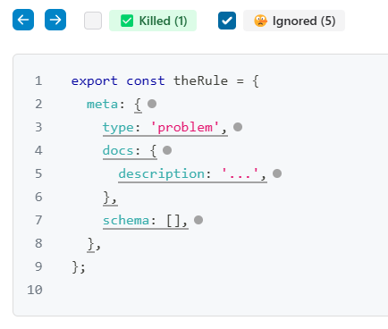
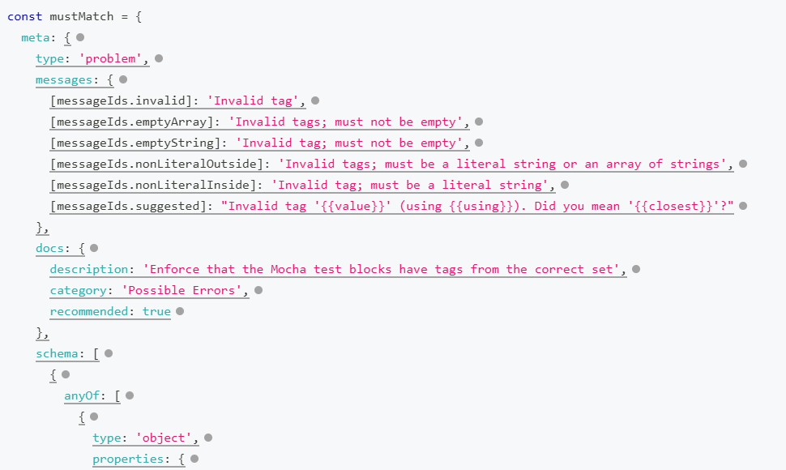

# Stryker ESLint plugin meta ignorer

Provides an ignorer plugin for [Stryker](https://stryker-mutator.io/docs/stryker-js/getting-started/), for use in an [ESLint plugin](https://eslint.org/docs/latest/extend/plugins). It ignores the `meta` property of a rule, which contains a type, documentation and a schema.

## Installation

Assuming you have Stryker installed and configured:

`npm install --save-dev stryker-eslint-plugin-meta-ignorer`

In your `stryker.conf.mjs` file, add or update the following two sections:

```javascript
export default {
  ...,
  ignorers: ['ignore-meta'],
  plugins: ['@stryker-mutator/*', 'stryker-eslint-plugin-meta-ignorer']
};
```

## What happens

A typical ESLint plugin will export a rule with some metadata:

```javascript
export const theRule = {
  meta: {
    type: 'problem',
    docs: {
      description: '...',
    },
    schema: [],
  },
};
```

It's not very useful to have a coverage report for this data. Instead of manually asking Stryker to ignore (with [// Stryker disable](https://stryker-mutator.io/docs/stryker-js/disable-mutants/#using-a--stryker-disable-comment)), this plugin will ignore it for you.



It does this by looking for any object with a `meta` property that has at least the `type`, `docs` and `schema` properties (with the corresponding types).

A real example:



## Development

Start with `npm install --force`.

Linting is performed with `npm run lint`.

The tests are organized into two flavors.

- The first is unit tests: `npm run test:unit`
  - These run the `shouldIgnore`, method that Stryker uses for the ignorer, directly with babel for traversal.
  - They use the fixtures as code and check that there is an ignored part or not, as appropriate.
  - They are the coverage measurers that Stryker uses for the testing _of_ this package, via `stryker-package.conf.mjs`
- The next is integration tests: `npm run test:integration`
  - These run the `shouldIgnore` method indirectly, using Stryker itself.
  - Each of the fixtures is given to Stryker as code to be mutated. The test code covers each fixture (from `generator.test.mjs`) in order to not let surviving mutants through.
  - The output generated by Stryker (as JSON) is then compared with a known "good" snapshot. The "good"ness was determined by checking whether Stryker actually ignores the parts it should in its output HTML.

The tests in `generator.test.mjs` and `unit.test.mjs` should stay aligned. See the `prepack` script for the typical order in which to run these.
